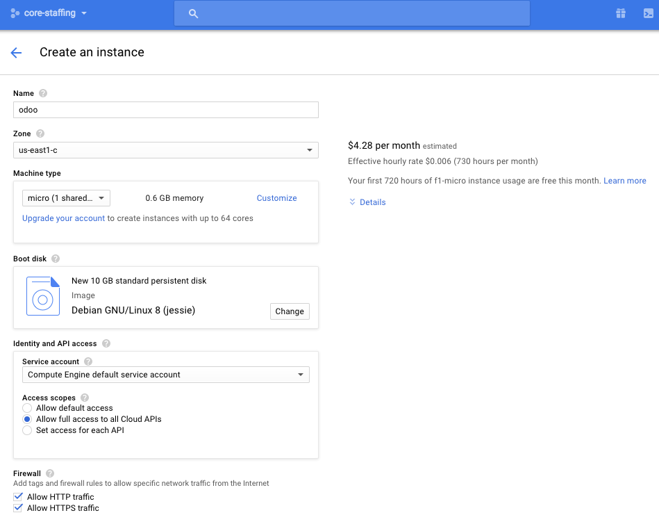
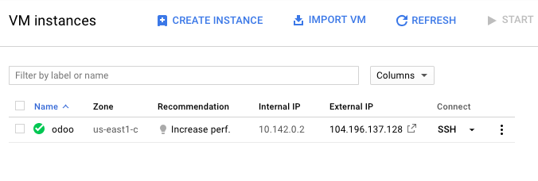
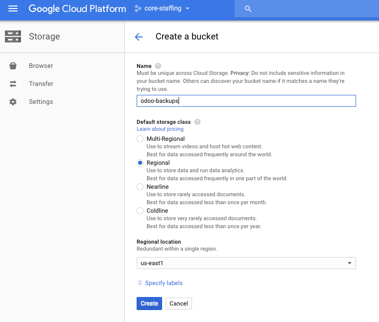
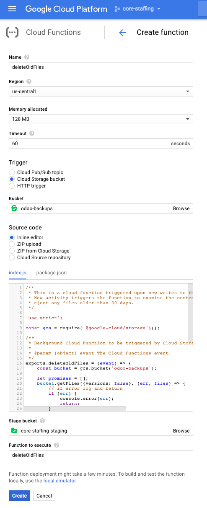

# How to set up the Core Staffing Odoo server

## 1. Create VM

From the [Google Cloud Platform Console](https://console.cloud.google.com), select Compute Engine and create a new VM instance with the following settings:



Note the following important settings:

* **Machine type: micro**. Google provides a [free tier](https://cloud.google.com/free/) with 1 free micro instance

* **Zone: us-east1**. [GCPing](http://gcping.com) from Baltimore, MD reports us-east4 as the fastest datacenter (18ms away). Unfortunately, as of this writing, free-tier instances are not available in us-east4. Therefore we select the next-fastest datacenter, us-east1 (30ms away).

* **Access scopes: Allow full acess to all Cloud APIs**: This project will use Cloud Storage, Logging, and Deployment APIs.

## 2. Promote VM's IPv4 address to static

* By default all ipv4 addresses routing to VMs are empheral. To promote our VM's ipv4 address to static locate the address under Networking > External IP addresses and select Type: Static


## 3. Install Docker Community Edition

* Connect to the new server via SSH by tapping SSH in the server list


* Complete the [Docker installation instructions for Debian](https://docs.docker.com/engine/installation/linux/debian/)

* [Install Docker Compose](https://docs.docker.com/compose/install/). As of this writing the instructions are to download from the [Github Repo](https://github.com/docker/compose/releases) and install manually.

* Run `docker -v` and `docker-compose -v` to verify both are installed succesfully. 

## 4. Install Odoo container images

* Copy `docker-compose.yml` from the [Odoo Docker Store](https://store.docker.com/images/odoo)

* Change line 8 of `docker-compose.yml` from `      - "80:8069"` to `      - "8069:8069"`

* Run `sudo docker-compose up -d` to start odoo. The first run will take several minutes to complete.

* Visit http://[server ip]:8069 to verify odoo is running.

## 5. Configure Odoo to start on (re)boot

* Copy `scripts/odoo-start` to /etc/init.d.

* Run `sudo chmod 755 /etc/init.d/odoo-start` to make the odoo startup script executable.

* Run `sudo update-rc.d odoo-start defaults` to run odoo at the default runlevel.

* Run `sudo shutdown -r now` to restart the server. Verify odoo is running after restart by visiting the login page.

## 6. Schedule daily backups to Cloud Storage

* Create a cloud storage bucket with the following settings



* Note especially the **Regional** setting. This is the level which qualifies for free-tier allowance. Selecting us-east1 ensures the fastest connection to our us-east1 based server and saves us from paying any inter-region bandwidth usage.

* Copy `scripts/odoo-backup.sh` from this repo to `/usr/local/sbin/`.

* Run `sudo chmod 755 /usr/local/sbin/odoo-backup.sh` to make the backup script executable.

* Add the job to cron to run overnight. Run `sudo crontab -e` and add a new cron entry `20 8 * * * /usr/local/sbin/odoo-backup.sh` at the bottom of the file. This will set the job to run at 8:20AM UTC every day, which is 3:20am or 4:20am eastern, depending on whether daylight saving is in effect.

## 7. Add Cloud Function to Cloud Storage

Free tier provides 5GB of free storage. To keep the accumulated backups from exceeding the free allowance attach a cloud function to the storage bucket to eject old backups.

* Go to [Cloud Functions](https://console.cloud.google.com/functions) in the Console.

* Create a new Cloud Function with the following settings. Copy & Paste `package.json` and `index.js` from the `scripts` subdirectory in this repo



## 8. Configure nginx reverse proxy server

* Run `sudo apt-get install nginx` to install nginx

* Run `sudo systemctl enable nginx` to enable nginx to restart automatically when the server restarts

* Modify `/etc/nginx/sites-enabled/default` Under the section `server` => `location /` comment out `try_files $uri $uri/ =404;` and directly beneath that line add `proxy_pass http://127.0.0.1:8069/;`

* Run `sudo nginx -t` to confirm changes are valid.

* Restart nginx `sudo systemctl restart nginx`

* Test the nginx setup by visiting http://[server ip]. You should see the odoo welcome screen.

## 9. Add DNS Entries

* Add A record to point odoo.corestaffing.us to our odoo server
`odoo.corestaffing.us A 104.196.117.29`

* Add CNAME record to point jobs.corestaffing.us to wherever our odoo server is
`jobs.corestaffing.us CNAME odoo.corestaffing.us` 

* Add SPF record so receivers don't mark as spam @corestaffing.us addressed mail originating from google or our odoo server `corestaffing.us TXT "v=spf1 include:_spf.google.com include:odoo.corestaffing.us ~all"`

## 10. Set up HTTPS

* Run `sudo apt-get install certbot -t jessie-backports` to install Let's Encrypt certbot

* Modify nginx settings to allow access to webroot certbot validation public keys in `/etc/nginx/sites-available/default`. Underneath the existing `location /` block add a new block
```location ~ /.well-known {
	allow all;
}```

* Run `sudo certbot certonly -a webroot --webroot-path=/var/www/html -d odoo.corestaffing.us -d jobs.coresta
ffing.us` to generate certificates

* Generate a strong Diffie-Hellman group by running `sudo openssl dhparam -out /etc/ssl/certs/dhparam.pem 2048`. This takes several minutes to run on a micro instance

* Copy `nginx/ssl-odoo.corestaffing.us.conf` from this repo to `/etc/nginx/snippets/ssl-odoo.corestaffing.us.conf`

* Copy `nginx/ssl-params.conf` from this repo to `/etc/nginx/snippets/ssl-params.conf`

* Copy `nginx/default` from this repo to `/etc/nginx/sites-available/default`

* Restart nginx `sudo systemctl restart nginx`

* Add the job to cron to check and renew the certificate as needed. Run `sudo crontab -e` and add a new cron entry `45 8 * * * /usr/bin/certbot renew --noninteractive --renew-hook "/bin/systemctl reload nginx" >> /var/log/le-renew.log` at the bottom of the file