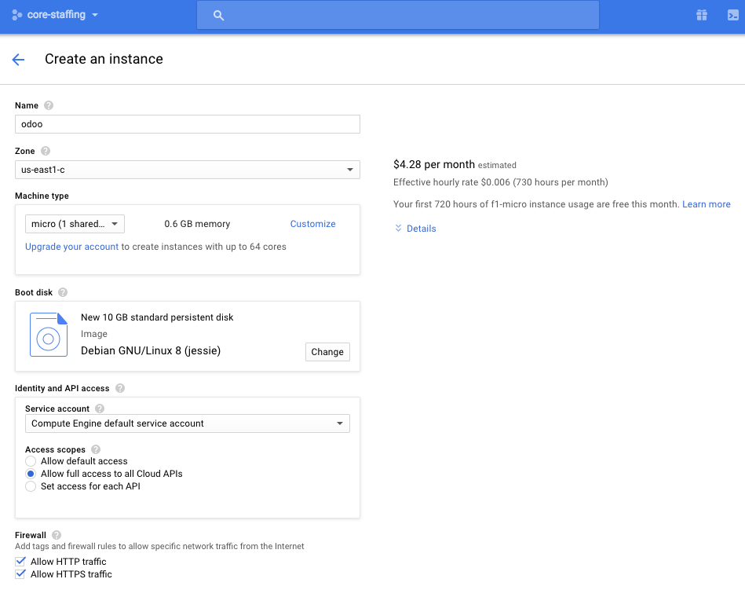
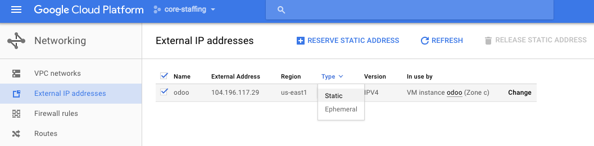
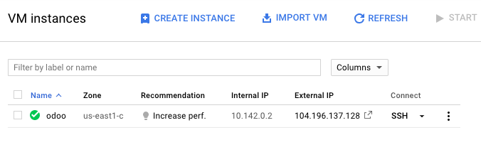
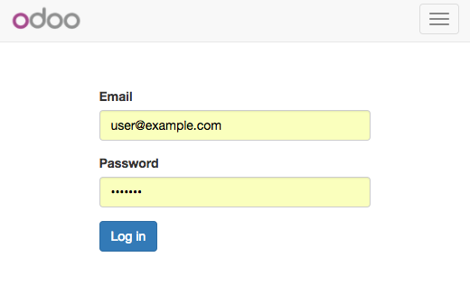
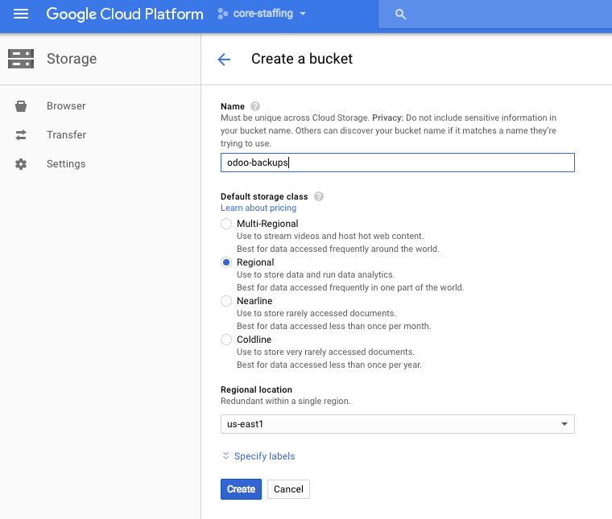
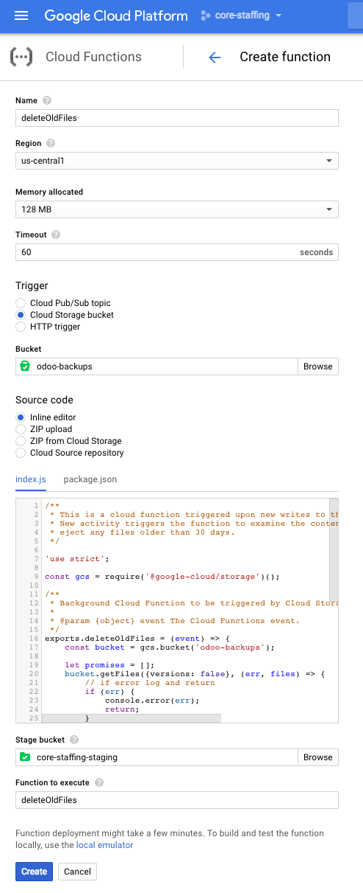

# How to set up the Core Staffing Odoo server

## 1. Create VM

From the [Google Cloud Platform Console](https://console.cloud.google.com), select Compute Engine and create a new VM instance with the following settings:

Note the following important settings:

* **Machine type: micro**. Google provides a [free tier](https://cloud.google.com/free/) with 1 free micro instance

* **Zone: us-east1**. [GCPing](http://gcping.com) from Baltimore, MD reports us-east4 as the fastest datacenter (18ms away). Unfortunately, as of this writing, free-tier instances are not available in us-east4. Therefore we select the next-fastest datacenter, us-east1 (30ms away).

* **Access scopes: Allow full acess to all Cloud APIs**: This project will use Cloud Storage, Logging, and Deployment APIs.

## 2. Promote VM's IPv4 address to static

* By default all ipv4 addresses routing to VMs are empheral. To promote our VM's ipv4 address to static locate the address under Networking > External IP addresses and select Type: Static

## 3. Install Docker Community Edition

* Connect to the new server via SSH by tapping SSH in the server list

* Complete the [Docker installation instructions for Debian](https://docs.docker.com/engine/installation/linux/debian/)

* [Install Docker Compose](https://docs.docker.com/compose/install/). As of this writing the instructions are to download from the [Github Repo](https://github.com/docker/compose/releases) and install manually.

* Run `docker -v` and `docker-compose -v` to verify both are installed succesfully. 

## 4. Install Odoo container images

* Copy `docker-compose.yml` from the [Bitnami Odoo docker image repo](https://github.com/bitnami/bitnami-docker-odoo/blob/master/docker-compose.yml)

* Run `sudo docker-compose up -d` to start odoo. The first run will take several minutes to complete.

* Visit http://[server ip] to verify odoo is running. You should see login prompt like below. The default credentials are `user@example.com` / `bitnami`

## 5. Configure Odoo to start on (re)boot

* Copy `odoo-start` to /etc/init.d.

* Run `sudo chmod 755 /etc/init.d/odoo-start` to make the odoo startup script executable.

* Run `sudo update-rc.d odoo-start defaults` to run odoo at the default runlevel.

* Run `sudo shutdown -r now` to restart the server. Verify odoo is running after restart by visiting the login page.

## 6. Schedule daily backups to Cloud Storage

* Create a cloud storage bucket with the following settings

* Note especially the **Regional** setting. This is the level which qualifies for free-tier allowance. Selecting us-east1 ensures the fastest connection to our us-east1 based server and saves us from paying any inter-region bandwidth usage.

* Copy `odoo-backup.sh` from this repo to `/usr/local/sbin/`.

* Run `sudo chmod 755 /usr/local/sbin/odoo-backup.sh` to make the backup script executable.

* Add the job to cron to run overnight. Run `sudo crontab -e` and add a new cron entry `20 8 * * * /usr/local/sbin/odoo-backup.sh` at the bottom of the file. This will set the job to run at 8:20AM UTC every day, which is 3:20am or 4:20am eastern, depending on whether daylight saving is in effect.

## 7. Add Cloud Function to Cloud Storage

Free tier provides 5GB of free storage. To keep the accumulated backups from exceeding the free allowance attach a cloud function to the storage bucket to eject old backups.

* Go to [Cloud Functions](https://console.cloud.google.com/functions) in the Console.

* Create a new Cloud Function with the following settings. Copy & Paste `package.json` and `index.js` from this repo

